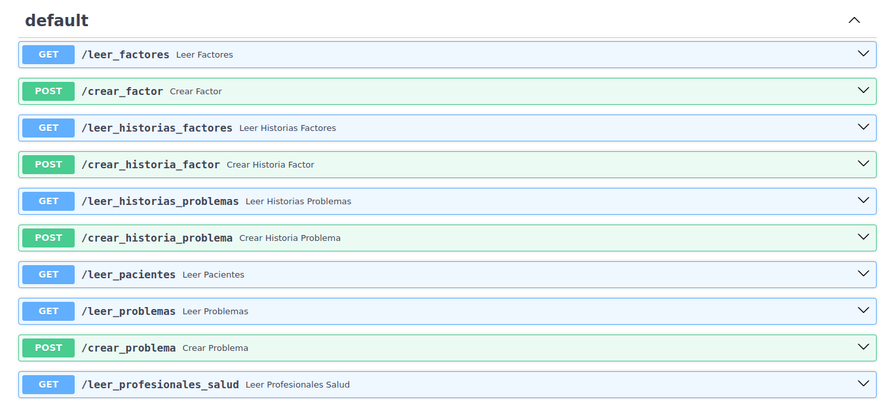

# Documentación del Proyecto - Historia Clínica Electrónica

Este documento proporciona una descripción general y una documentación básica del proyecto de Historia Clínica Electrónica, que utiliza FastAPI y SQLAlchemy para conectar una base de datos local con la API.

## Estructura del Proyecto

El proyecto tiene varias clases que representan entidades relacionadas con la Historia Clínica Electrónica. Estas clases están definidas en el archivo `data/database.py` y en `/src`, y heredan de la clase `Base` proporcionada por SQLAlchemy.

### Clases del Modelo de Datos

1. **FactorRiesgo**
   - **Tabla:** 'Factor Riesgo'
   - **Campos:**
     - `identificacionFactorRiesgo`: Identificador único del factor de riesgo (clave primaria, autoincremental).
     - `identificacionPaciente`: Identificador del paciente asociado al factor de riesgo.
     - `identificacionProfesionalSalud`: Identificador del profesional de la salud asociado al factor de riesgo.
     - `nombre`: Nombre del factor de riesgo.
     - `estatus`: Estado del factor de riesgo.
     - `tipo`: Tipo del factor de riesgo.
     - `motivoCierre`: Motivo de cierre del factor de riesgo.
     - `notas`: Notas relacionadas con el factor de riesgo.

2. **HistoriaFactor**
   - **Tabla:** 'Historia Factor'
   - **Campos:**
     - `identificacionHistoriaFactor`: Identificador único de la historia del factor (clave primaria, autoincremental).
     - `identificacionFactorRiesgo`: Identificador del factor de riesgo asociado a la historia.
     - `fecha`: Fecha de la historia del factor.
     - `estatus`: Estado de la historia del factor.
     - `observacion`: Observación relacionada con la historia del factor.

3. **HistoriaProblema**
   - **Tabla:** 'Historia Problema'
   - **Campos:**
     - `identificacionHistoriaProblema`: Identificador único de la historia del problema (clave primaria, autoincremental).
     - `identificacionProblema`: Identificador del problema asociado a la historia.
     - `fecha`: Fecha de la historia del problema.
     - `estatus`: Estado de la historia del problema.
     - `observacion`: Observación relacionada con la historia del problema.

4. **Paciente**
   - **Tabla:** 'Paciente'
   - **Campos:**
     - `identificacionPaciente`: Identificador único del paciente (clave primaria, autoincremental).
     - `historiaPrevia`: Historia previa del paciente.

5. **Problema**
   - **Tabla:** 'Problema'
   - **Campos:**
     - `identificacionProblema`: Identificador único del problema (clave primaria, autoincremental).
     - `identificacionPaciente`: Identificador del paciente asociado al problema.
     - `identificacionProfesionalSalud`: Identificador del profesional de la salud asociado al problema.
     - `nombre`: Nombre del problema.
     - `estatus`: Estado del problema.
     - `tipo`: Tipo del problema.
     - `motivoCierre`: Motivo de cierre del problema.
     - `notas`: Notas relacionadas con el problema.

6. **ProfesionalSalud**
   - **Tabla:** 'ProfesionalSalud'
   - **Campos:**
     - `identificacionProfesionalSalud`: Identificador único del profesional de la salud (clave primaria, autoincremental).

## Uso de FastAPI y SQLAlchemy

El proyecto utiliza FastAPI como marco web para exponer la funcionalidad a través de una API REST. SQLAlchemy se emplea para la conexión y manipulación de la base de datos SQLite local.

# Métodos de la API

